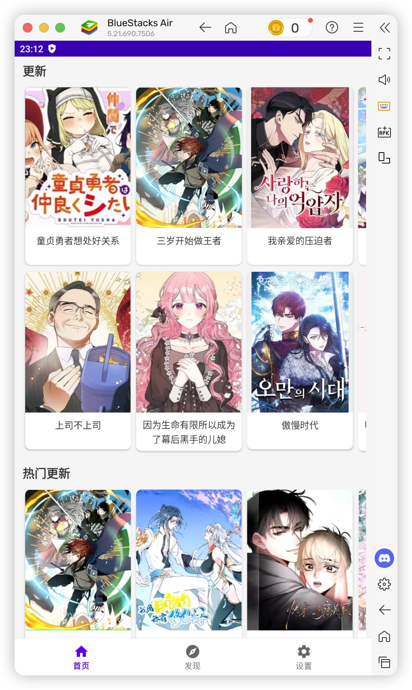
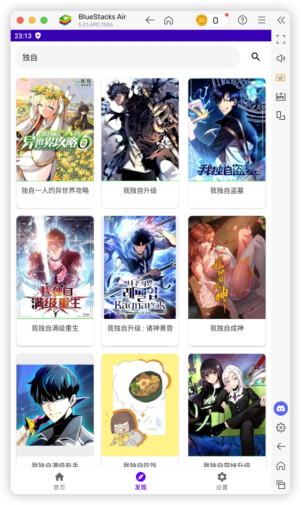
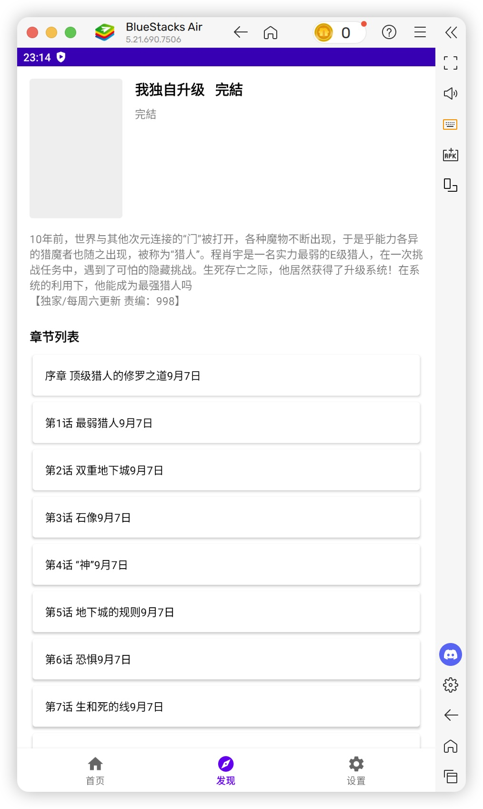
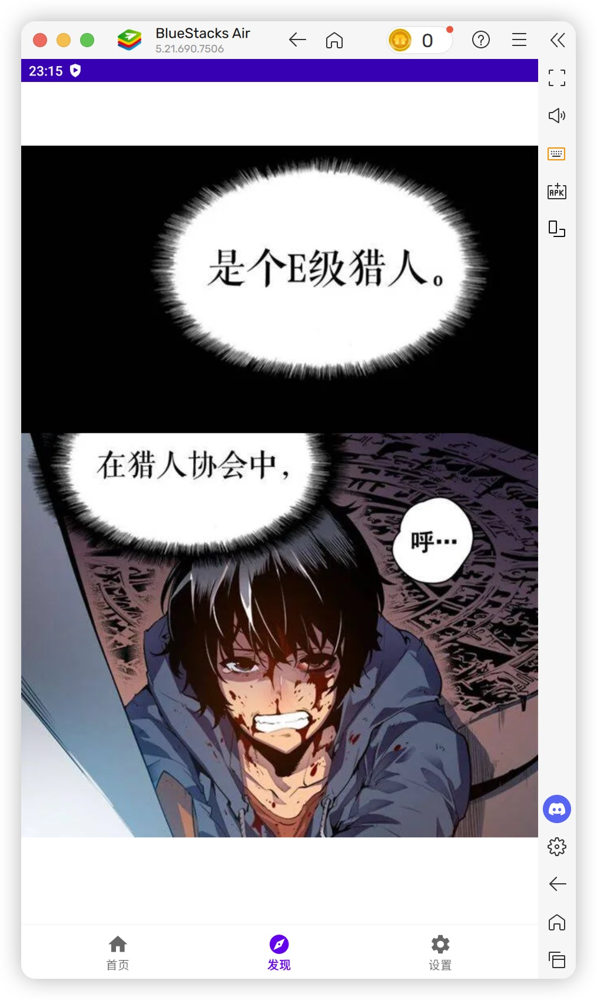

# JManga - 日本漫画阅读器

JManga是一款Android平台的漫画阅读应用，专注于提供流畅的日本漫画阅读体验。

## 应用界面展示






*应用首页展示了最新更新和热门漫画，提供丰富多样的漫画选择。*

## 功能特点

- 🏠 **首页推荐**：展示热门和推荐漫画
- 🔍 **探索发现**：浏览和搜索漫画库
- 📖 **阅读体验**：流畅的漫画阅读界面
- ⭐ **收藏功能**：收藏喜爱的漫画作品
- 🔄 **阅读进度同步**：记录并同步阅读进度
- ⚙️ **个性化设置**：自定义阅读体验

## 技术栈

- **语言**：Kotlin
- **架构**：MVVM架构
- **网络**：Retrofit2 + OkHttp3
- **图片加载**：Glide
- **异步处理**：Kotlin协程
- **UI组件**：Material Design组件
- **数据解析**：Gson

## 系统要求

- Android 8.1 (API 27) 或更高版本
- 网络连接

## 安装说明

1. 从Release页面下载最新APK
2. 在Android设备上安装APK
3. 打开应用并开始使用

或者从源码构建：

```bash
# 克隆仓库
git clone https://github.com/yourusername/jmanga.git

# 进入项目目录
cd jmanga

# 使用Gradle构建
./gradlew assembleDebug
```

## 使用方法

1. **浏览漫画**：在首页或探索页面浏览漫画
2. **搜索**：使用搜索功能查找特定漫画
3. **阅读**：点击漫画封面进入详情页，选择章节开始阅读
4. **收藏**：在漫画详情页点击收藏按钮将漫画添加到收藏列表
5. **设置**：在设置页面自定义阅读体验

## 应用特色

JManga提供多种类型的漫画，包括但不限于：

- 热血冒险
- 校园恋爱
- 奇幻冒险
- 职场生活
- 悬疑推理

所有漫画均提供高清图片和流畅的阅读体验，支持左右滑动和上下滑动两种阅读模式。

## 项目结构

```
app/
├── src/main/
│   ├── java/com/ruble/jmanga/
│   │   ├── adapter/       # RecyclerView适配器
│   │   ├── api/           # 网络API接口
│   │   ├── model/         # 数据模型
│   │   ├── ui/            # UI相关组件
│   │   ├── App.kt         # 应用程序类
│   │   ├── MainActivity.kt # 主活动
│   │   └── ...
│   ├── res/               # 资源文件
│   └── AndroidManifest.xml # 应用清单
└── build.gradle           # 应用级构建配置
```

## 后端地址
https://github.com/axcda/crawler_manga

## 贡献指南

欢迎贡献代码、报告问题或提出新功能建议。请遵循以下步骤：

1. Fork项目
2. 创建功能分支 (`git checkout -b feature/amazing-feature`)
3. 提交更改 (`git commit -m 'Add some amazing feature'`)
4. 推送到分支 (`git push origin feature/amazing-feature`)
5. 创建Pull Request

## 许可证

本项目采用MIT许可证 - 详情请参阅 [LICENSE](LICENSE) 文件

## 联系方式

如有任何问题或建议，请通过以下方式联系我们：

- 电子邮件：your.email@example.com
- GitHub Issues：[https://github.com/yourusername/jmanga/issues](https://github.com/yourusername/jmanga/issues)

---

**注意**：本应用仅供学习和研究使用，请尊重版权，不要用于非法用途。